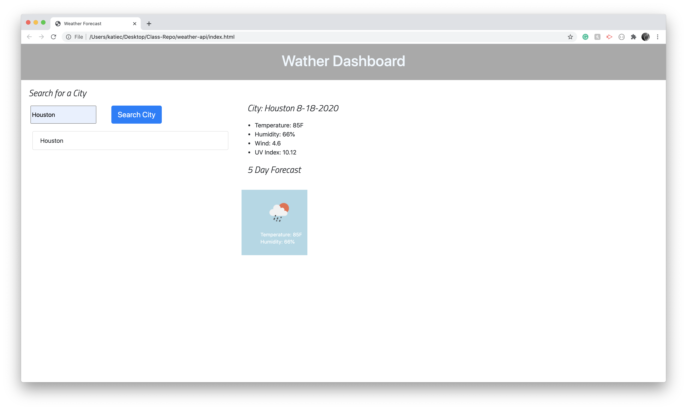

# Weather API 

The goal of this application was to be able to see the current weather and five day forecast of a city that was input by the user. When the user enters a city it is saved in the local storage and shown in the search history. 

# What I Learned 

The most exciting aspect this project for me was the local storage. It was the first time I was able to get the storage to function properly. I did not finish the five day forecast but was able to pull the array, and show the first (object) day forecast. I was trying to play with creating a loop that would automatically create, and append all five days. I got stuck at trying to figure out how to append the child element to what I created. I did

# What I would Improve on

I would have liked to have made the city search history active so that when the user clicks on the previous cities they would show the results. I would have also like to have added a clear button for the history. 